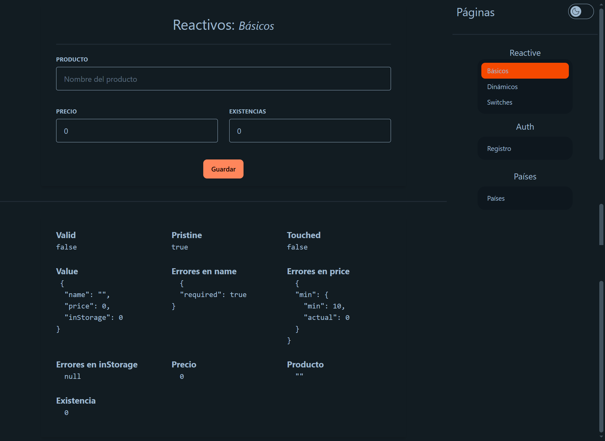
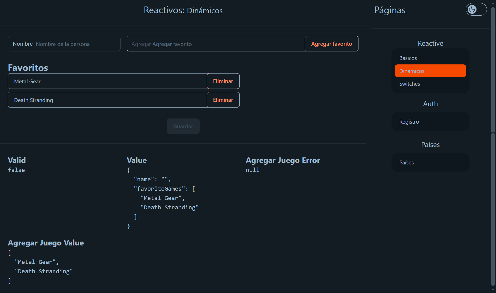
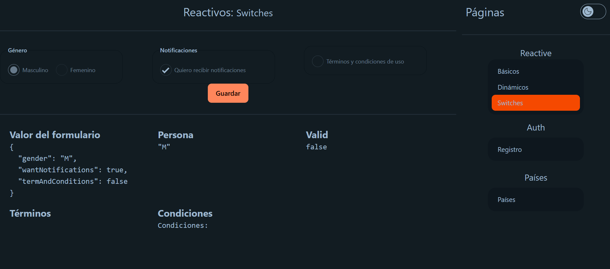
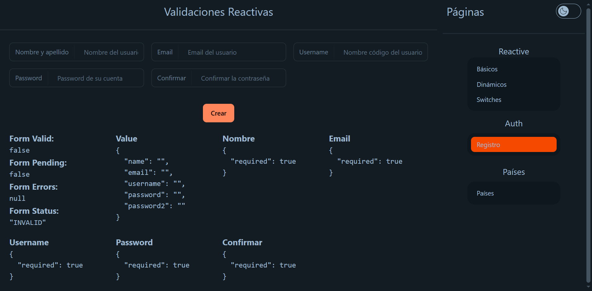
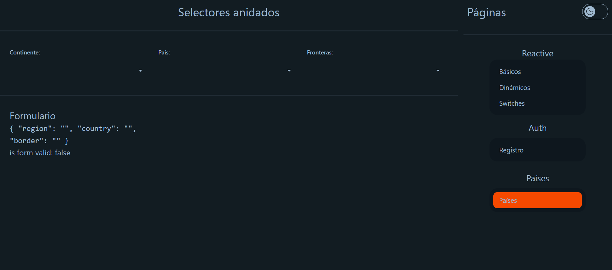

# AngularForms

<p align="center">
  &nbsp;
  
</p>

**AngularForms** aplicacion utilizando los formularios reactivos en angular y uso de la API **REST Countries**. Hecho con **Angular** y para los estilos **Tailwind CSS** y **daisyUI**.

## Run Locally

Clone the project

```bash
  git clone https://github.com/miguel-camara/angular-forms.git
```

Go to the project directory

```bash
  cd angular-forms
```

Install dependencies

```bash
  npm install
```

Generate the `.env` based on the `.env.template`

Run the script

```bash
  npm run set-env
```

Start the server

```bash
  npm run start
```

## Environment Variables

To run this project, you will need to add the following environment variables to your **environment.ts** files

`REST_COUNTRIES_API`

## Demo

[Demo](https://reactive-foms-miguel.netlify.app/#/reactive/basic)

## Screenshots











## Features

- **Angular Forms:** Aplicación en donde se usan los formularios reactivos en Angular, en donde se prueban las validaciones de formularios y el uso de la API de RestCountries para validar campos.
- **Reactive:** En esta sección se prueban los formularios reactivos con campos requeridos.
- **Auth:** En esta sección es la simulación de un login en donde se valida correo y contraseña.
- **Paises:** En esta sección se usa la API de RESTCountries en donde por medio de selectores obtenemos países dependiendo del selector anterior.

## Tech Stack

**Frontend:** Angular, Tailwind CSS y daisyUI
